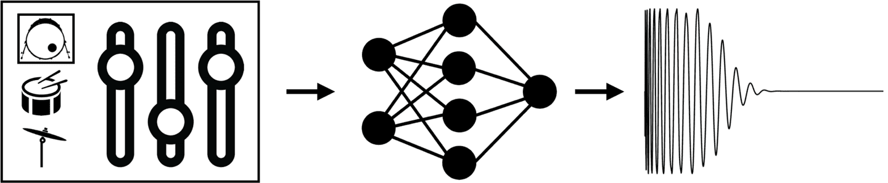

# Adversarial Drum Synth (ADS)
TensorFlow implementation of adversarial drum synth (ADS) from the paper [Adversarial Synthesis of Drum Sounds](https://dafx2020.mdw.ac.at/proceedings/papers/DAFx2020_paper_45.pdf) @ The 2020 DAFx Conference.



## Code

### Dependencies

#### Python

Code has been developed with `Python 3.8`. It should work with other versions of `Python 3`, but has not been tested. Moreover, we rely on several third-party libraries, listed in [`requirements.txt`](requirements.txt). They can be installed with

```bash
$ pip install -r requirements.txt
```

### Usage

The majority of the code is contained within three scripts `train.py`, `preproc.py` and `generate.py`. The first script `train.py` allows to train a new model from scratch as described in the paper. The `preproc.py` script is used to prepare a new dataset for training. The third script `generate.py` enables conditional synthesises of drum sounds using a pretrained generator.


#### train.py arguments

| Parameter                 | Default       | Description   |	
| :------------------------ |:-------------:| :-------------|
| --dataset	       |	-           |path to folder containing audio training data
| --preproc          | False           |run audio preprocessing script
| --n_classes 	       |	3	            |number of classes (e.g., kick, snare, cymbal)
| --sr  		       | 44100	           | audio sample rate 
| --audio_length 		           | 16384             | audio length in samples (must be a power of 2)
| --batch_size	        | 64           | training batch size
| --epochs	         | 2000             | number of cycles through the full dataset
| --lr          | 0.0002           | learning rate 
| --beta_1    | 0.5         | Adam beta 1 value 
| --n_d			             | 5 	           | number of discriminator updates per generator update
| --z_dim			     | 3         | latent dimensionality
| --e_dim			             | 50     	     | embedding layer dimensionality
| --num_res		    | 5     	     | number of upsampling/downsampling blocks
| --scale_base		      | 4     	   | upsampling/downsampling factor
| --n_filters		      | 1024     	   | maximum number of filters
| --adversarial_loss_mode		      | 'wgan'     	   | adversarial loss mode
| --gradient_penalty_mode		      | 'wgan-gp'     	   | gradient penalty mode
| --experiment_name		      | 'ADS_demo'     	   | name of the experiment


#### preproc.py

When training the system on your own dataset of drum sounds, the dataset must be prepared using the `preproc.py` script. Create a directory structure with a sub-directories for each class containing the appropriate drum sounds. Run `train.py` and set the --dataset parameter to the path of your dataset and then set --preproc to True. If training on a dataset that has already been prepared with `preproc.py`, --dataset can be set to the path of the preprocessed dataset, and --preproc can be set to False.


#### generate.py arguments

| Parameter                 | Default       | Description   |	
| :------------------------ |:-------------:| :-------------|
| --z          | 0.25 -0.25 0.25           |latent vector values for generation
| --condition	       |	0           |which class to generate (e.g., 0: kick, 1: snare, 2: cymbal)
| --weights	       |	'./output/demo'           |path of the pretrained generator weights to be loaded
| --output_dir	       |	'./generations'           |path to store generations
| --sr	       |	44100           |audio sample rate
| --name	       |	'generation'           |name of generation

Note that a pre-trained model is available in the `output/demo` folder.


## Supporting webpage


For more information, please **visit the corresponding [supporting website](https://jake-drysdale.github.io/blog/adversarial-drum-synthesis/)**.

It contains the following:
  * Audio examples
	* Training data
	* Generations
	* Example usage within loop-based electronic music compositions
	* Generating Drum Loops
	* Interpolation demonstration
  * Supplementary figures
  * A link to the DAFx 2020 paper and presentation


## References

| **[1]** |                  **[Drysdale, J., M. Tomczak, J. Hockman, Adversarial Synthesis of Drum Sounds. Proceedings of the 23rd International Conference on Digital Audio Effects (DAFX), 2020.](https://dafx2020.mdw.ac.at/proceedings/papers/DAFx2020_paper_45.pdf)**|
| :---- | :--- |

```
@inproceedings{drysdale2020ads,
  title={Adversarial synthesis of drum sounds},
  author={Drysdale, Jake and Tomczak, Maciej and Hockman, Jason},
  booktitle = {Proceedings of the International Conference on Digital Audio Effects (DAFx)},
  year={2020}
}
```


## Help

Any questions please feel free to contact me on jake.drysdale@bcu.ac.uk


